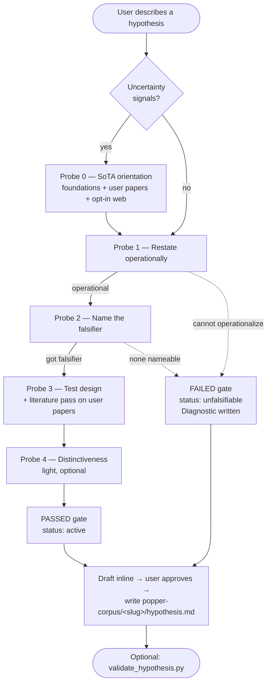

# popper-probe

**A research companion that tries to prove your hypotheses wrong.**

Most thinking tools help you build a case. This one helps you break it.

Inspired by Karl Popper, `popper-probe` is a Claude Code skill for
researchers. Bring a fuzzy idea or a half-formed claim, point it at the
papers you've been reading, and it will:

- sharpen the claim into something *risky* enough to be wrong,
- name the observations that would refute it,
- flag the hedges and ad-hoc rescues you didn't notice you were making.

Over time it keeps a markdown ledger of your hypotheses, the evidence
for and against, and the moments you should have changed your mind.

## Install

In any Claude Code session:

```
/plugin marketplace add mashathepotato/popper-probe
/plugin install popper-probe@popper
```

That installs `popper-probe` at the user level — available in every project,
not just one. Restart Claude Code (or `/reload-plugins`) and you're done.

To pull updates later:

```
/plugin marketplace update popper
```

## Use it

Start any Claude Code session and describe something hypothesis-shaped:

> *"I think X causes Y. Here are the papers I've been reading: refs/a.pdf, refs/b.pdf"*

`popper-probe` will run an adversarial-but-constructive Popperian dialogue
(optional state-of-the-art orientation, then operational restatement,
falsifier, test design, distinctiveness) and write a structured
`hypothesis.md` to `popper-corpus/<slug>/` in your working directory.

You can validate any hypothesis file against the schema with:

```
python3 scripts/validate_hypothesis.py popper-corpus/<slug>/hypothesis.md
```

## How it works



See [`docs/ARCHITECTURE.md`](docs/ARCHITECTURE.md) for static structure
and data-flow diagrams.

## Status

V1 — the intake skill. Corpus tooling, observation logging, and audits
follow in subsequent phases.

## Reference

- Canonical example output:
  [`docs/examples/popper-corpus/pea-plants-music-biomass/`](docs/examples/popper-corpus/pea-plants-music-biomass/)
- Design spec:
  [`docs/superpowers/specs/2026-05-11-popper-probe-intake-design.md`](docs/superpowers/specs/2026-05-11-popper-probe-intake-design.md)
- Implementation plan:
  [`docs/superpowers/plans/2026-05-11-popper-probe-intake-plan.md`](docs/superpowers/plans/2026-05-11-popper-probe-intake-plan.md)
- Vision for the full companion:
  [`context/overview.md`](context/overview.md)

