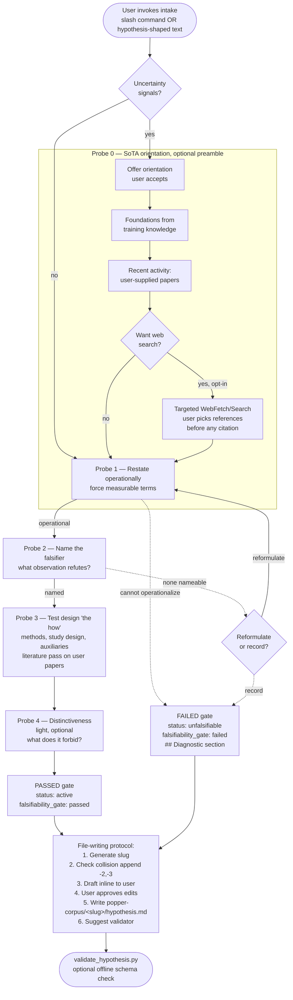
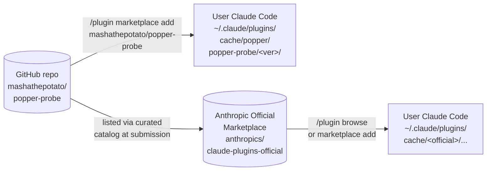
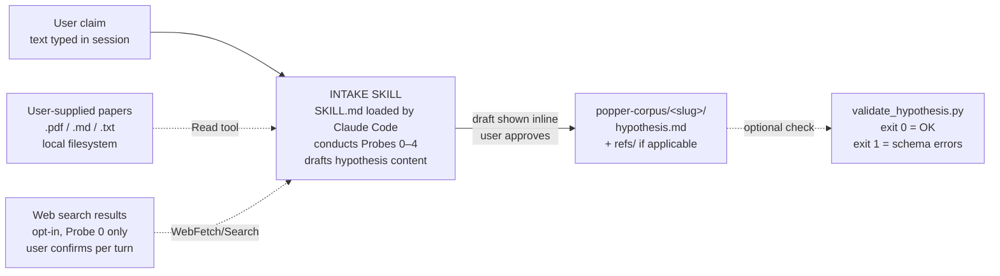

# popper-probe Architecture

Three views: runtime workflow, static structure, data flow.

---

## 1. Runtime workflow — the intake dialogue

The skill runs an optional preamble followed by four probes, terminating
either in a `passed` gate (well-formed falsifiable hypothesis) or a
`failed` gate (unfalsifiable as stated, with diagnostic).



### Load-bearing properties

- **Termination is content-gated, not turn-count gated.** The skill
  writes a `passed` file only when probes 1–3 produce their required
  substance; it writes a `failed` file with a diagnostic when sharpening
  genuinely couldn't happen.
- **Network access is gated twice.** Once at the probe level (only
  Probe 0 can search) and once per turn (user must explicitly confirm).
  Probe 3's literature pass is offline by design.
- **No partial files appear mid-conversation.** The draft is shown
  inline; only after user approval does it land on disk.

---

## 2. Static structure — repo, install path, runtime layout

```
github.com/mashathepotato/popper-probe
├── .claude-plugin/
│   ├── plugin.json          ← manifest (name, version, license, ...)
│   └── marketplace.json     ← catalog (lists popper-probe under 'popper')
├── skills/intake/
│   └── SKILL.md             ← THE prompt body
│                              (Probes 0–4, termination, file-writing)
├── scripts/
│   └── validate_hypothesis.py    ← offline schema validator
├── tests/
│   ├── test_validate_hypothesis.py
│   ├── fixtures/            ← 7 eval scenarios + synthetic ref paper
│   ├── rubric.md            ← human review checklist
│   └── README.md            ← how to run an eval
├── docs/
│   ├── examples/popper-corpus/  ← canonical hypothesis file
│   ├── superpowers/specs/   ← design specs
│   ├── superpowers/plans/   ← implementation plans
│   └── ARCHITECTURE.md      ← this file
├── context/
│   └── overview.md          ← cross-session project memory
├── README.md
├── PRIVACY.md
└── LICENSE
```

### Distribution paths



Plugins are pinned to a git commit SHA at install time. Updates require
the user to run `/plugin marketplace update <name>` and reinstall.

---

## 3. Data flow — what reads what, what writes what



### What lives on disk after a session

```
popper-corpus/
└── <slug>/
    ├── hypothesis.md     ← YAML frontmatter + structured sections
    └── refs/             ← only if the user staged papers here
        ├── chen-2021.pdf
        └── ...
```

All artifacts are local. The plugin has no backend, telemetry, or
external data store of its own. See [`PRIVACY.md`](../PRIVACY.md) for
the full data-handling statement.

---

## 4. Where each piece is enforced

| Property | Enforced by |
|---|---|
| Schema structure of hypothesis.md | `scripts/validate_hypothesis.py` (objective, runnable) |
| Conversation behavior (probes asked in order, tone, no hallucinated citations) | `tests/rubric.md` (human review) |
| Probes 1–3 must produce non-empty content | validator + SKILL.md termination gate |
| Mandatory `contribution:` field on references | validator |
| No paper cited without being read | SKILL.md instruction + rubric anti-hallucination check |
| File never overwrites; collisions get `-2`, `-3` | SKILL.md file-writing protocol |
